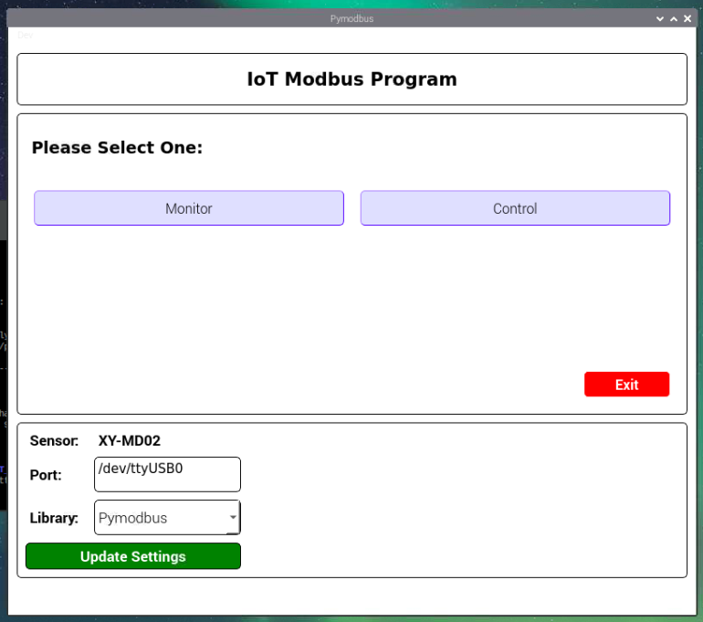
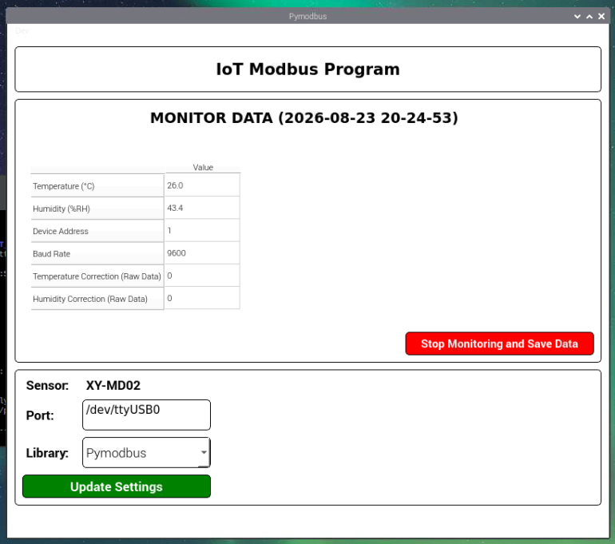
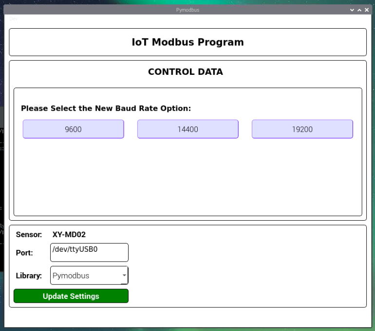
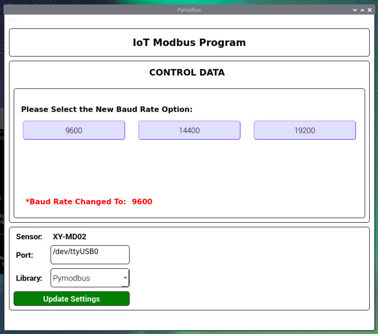
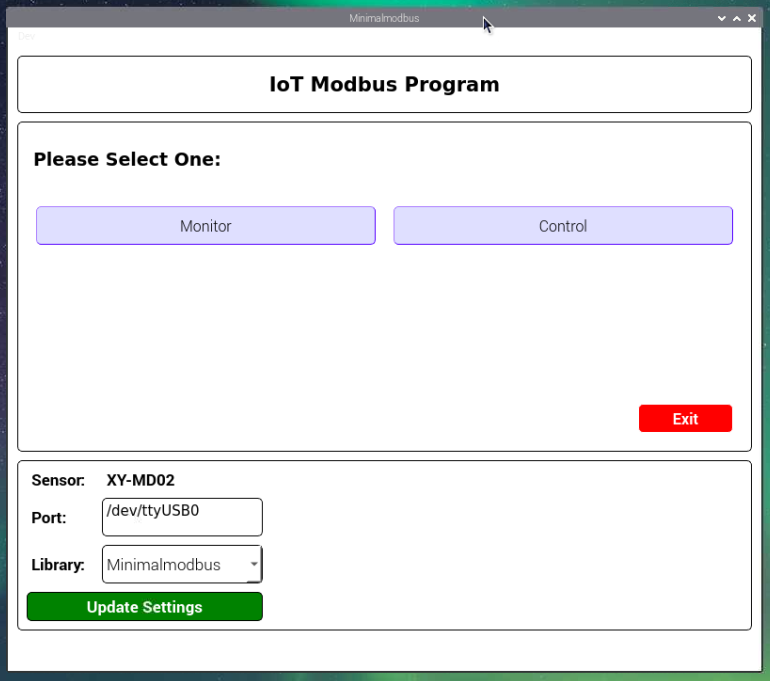

## IoT Learning Task

Name: Muhammad Ammar Hanif

ITB de Labo Batch: 12

Team: IoT & PLC

### You can refer each progress inside each folder based on its folder name. There will be mainly 3 structure, which are:
1. Chipkin Data Display
2. No Raspi (Run in Laptop/PC)
3. Raspi (Run directly in the Raspi)

### Graphical User Interface from The Raspi

