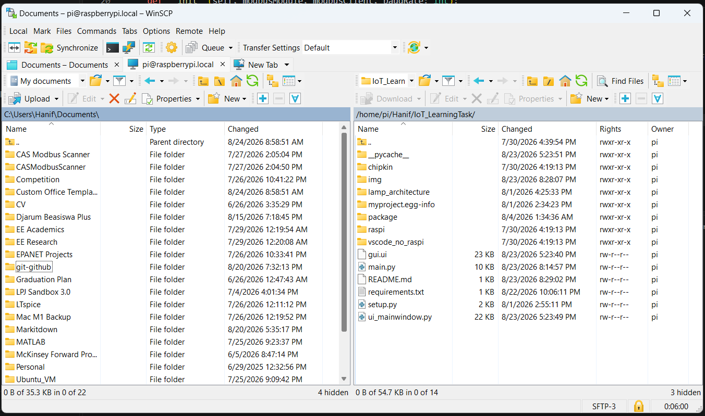
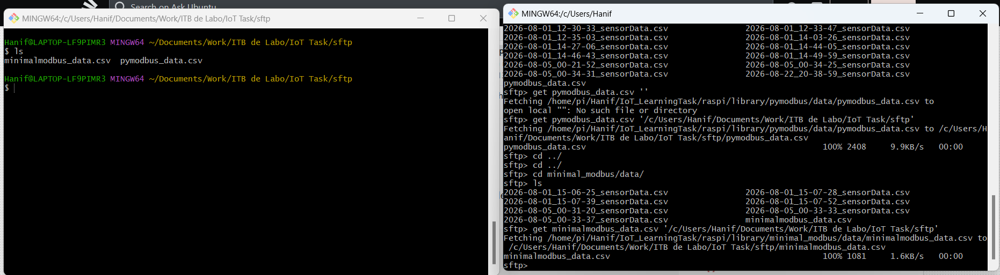
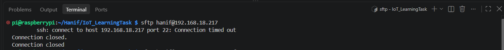

## IoT Learning Task

Name: Muhammad Ammar Hanif

ITB de Labo Batch: 12

Team: IoT & PLC

### You can refer each progress inside each folder based on its folder name. There will be mainly 3 structure, which are:
1. Chipkin Data Display
2. No Raspi (Run in Laptop/PC)
3. Raspi (Run directly in the Raspi)

### Graphical User Interface from The Raspi

### Manual SFTP (Secure/SSH File Transfer Protocol)

_Manual means that the process needs to be run by a user directly (picking which file to transfer, running the transfer command)_

#### Access Through WinSCP Client (From my Windows Laptop)

#### Access Through Command Line Through SSH (Local Server: Windows Laptop)

#### Access Through Command Line Through SSH (Local Server: Raspi)

(note that this connection still does not work for now, the Screenshot is the Fail Example)

