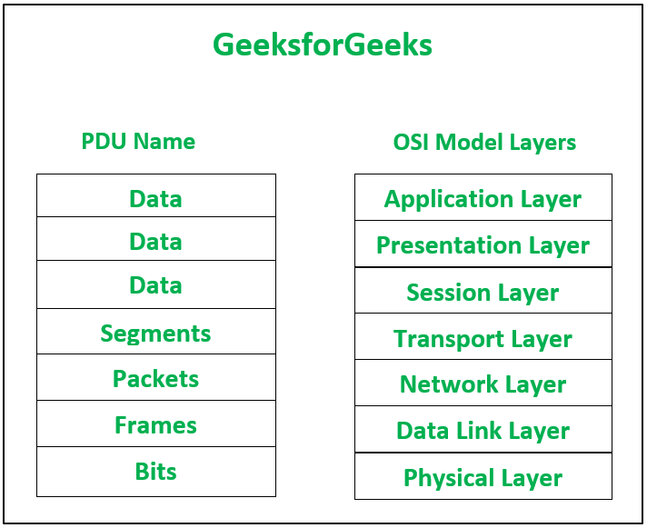
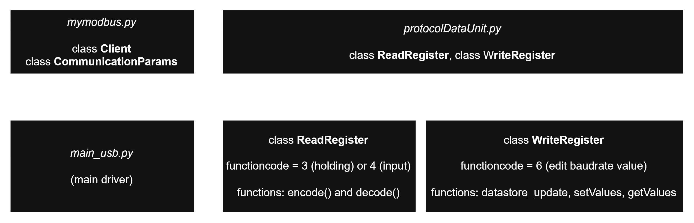

## No Library Raspi Program (Purely Serial)

Language: Python

Mainly use this function
```python
import serial
```

### Concept of PDU: Protocol Data Unit

[geeksforgeeks article](https://www.geeksforgeeks.org/computer-networks/protocol-data-unit-pdu/)


<center><b>Figure 1</b>. PDU Name and OSI Model Layers Comparisson Based on their Level.</center>

### Program Python Class Architecture Plan


<center><b>Figure 2</b>. Python Class Architecture Plan.</center>